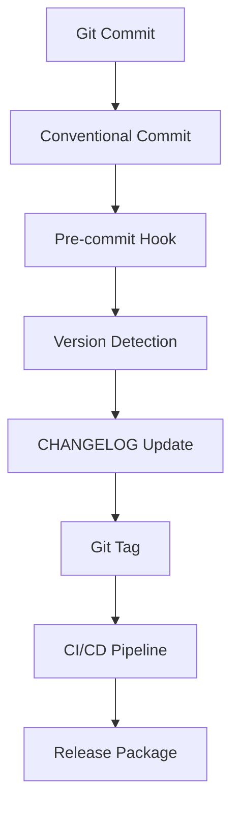

# Sistem Versioning MONIK-ENTERPRISE

Dokumentasi ini menjelaskan sistem versioning terpadu yang digunakan dalam proyek MONIK-ENTERPRISE.

## 📋 Gambaran Umum

Sistem versioning ini menggunakan pendekatan **Semantic Versioning (SemVer)** dengan otomatisasi berbasis **Conventional Commits**. Seluruh perubahan proyek terdokumentasi dalam satu CHANGELOG terpadu.

## 🏗️ Arsitektur Versioning



## 📝 Format Conventional Commits

Semua commit harus mengikuti format berikut:

```
<type>(<scope>): <deskripsi>

[badan opsional]

[footer opsional]
```

### Jenis Commit

| Jenis | Deskripsi | Contoh |
|------|-----------|--------|
| `feat` | Fitur baru | `feat(api): tambahkan otentikasi pengguna` |
| `fix` | Perbaikan bug | `fix(database): perbaiki timeout koneksi` |
| `perf` | Optimasi performa | `perf(api): optimasi kinerja query` |
| `revert` | Revert perubahan | `revert(feat): batalkan otentikasi pengguna` |
| `docs` | Perubahan dokumentasi | `docs(readme): perbarui panduan instalasi` |
| `style` | Perubahan formatting | `style(code): perbaiki indentasi` |
| `refactor` | Refactoring kode | `refactor(api): sederhanakan logika endpoint` |
| `test` | Perubahan testing | `test(api): tambahkan unit test` |
| `chore` | Perubahan maintenance | `chore(deps): perbarui dependensi` |

### Scope Commit

| Scope | Deskripsi | Contoh |
|-------|-----------|--------|
| `api` | Endpoint API | `feat(api): tambahkan endpoint baru` |
| `database` | Skema database | `fix(database): perbaiki migrasi` |
| `frontend` | Kode frontend | `feat(frontend): tambahkan dashboard` |
| `backend` | Kode backend | `perf(backend): optimasi query` |
| `config` | Konfigurasi | `chore(config): perbarui pengaturan` |
| `deps` | Dependensi | `chore(deps): perbarui paket` |

### Perubahan Breaking

Untuk perubahan yang bersifat breaking, tambahkan `BREAKING CHANGE:` di footer commit:

```
feat(api): tambahkan metode otentikasi baru

BREAKING CHANGE: Metode otentikasi lama dihapus
```

## 🔄 Aturan Versioning

### Semantic Versioning (SemVer)

Format: `MAJOR.MINOR.PATCH`

- **MAJOR**: Perubahan breaking (API, skema database, arsitektur)
- **MINOR**: Fitur baru backward compatible
- **PATCH**: Perbaikan bug dan optimasi

### Logika Deteksi Version

1. **Perubahan Breaking** → MAJOR version
2. **Jenis feat** → MINOR version
3. **Jenis fix, perf, refactor** → PATCH version
4. **Jenis docs, style, test, chore** → Tidak ada version bump

## 📋 Format CHANGELOG

CHANGELOG mengikuti format [Keep a Changelog](https://keepachangelog.com/en/1.0.0/):

```markdown
## [Versi] - YYYY-MM-DD

### Ditambahkan
- Fitur baru

### Diubah
- Perubahan pada fungsionalitas yang ada

### Diperbaiki
- Perbaikan bug

### Keamanan
- Perubahan terkait keamanan

### Diuji
- Perubahan terkait testing

### Depresiasi
- Fitur yang akan dihapus
```

## 🚀 Proses Release

### Otomatis (Direkomendasikan)

1. Buat commit dengan format conventional commits
2. Push ke branch `main` atau `master`
3. Pipeline CI/CD akan:
   - Mendeteksi jenis perubahan
   - Membuat versi baru
   - Memperbarui CHANGELOG
   - Membuat Git tag
   - Membuat release di GitHub

### Manual

Gunakan script versioning:

```bash
# Jalankan version bump manual
./scripts/version-bump.sh

# Jalankan migrasi CHANGELOG
./scripts/migrate-changelog.sh
```

## 🔧 Konfigurasi

### File Konfigurasi

- `.versionrc.json` - Konfigurasi semantic release
- `.github/workflows/release.yml` - Pipeline CI/CD
- `.git/hooks/pre-commit` - Validasi pre-commit

### Variabel Lingkungan

```bash
VERSIONING_ENABLED=true
VERSIONING_STRATEGY=semantic
CHANGELOG_PATH=CHANGELOG.md
APP_VERSION=1.0.0
```

## 📊 Versioning Multi-Komponen

### Struktur Komponen

| Komponen | File | Versioning |
|----------|------|------------|
| Backend | `go.mod` | Versi module Go |
| Frontend | `package.json` | Versi paket NPM |
| Database | File migrasi | Versi skema |
| API | Prefiks URL | `/api/v1/` |

### Versioning Independent

Setiap komponen dapat memiliki versi berbeda jika menggunakan strategi independent versioning.

## 🧪 Testing

### Unit Test

```bash
# Testing logika deteksi version
go test ./internal/versioning/...

# Testing pembuatan CHANGELOG
go test ./internal/changelog/...
```

### Testing Integrasi

```bash
# Testing pipeline CI/CD
./scripts/test-ci-pipeline.sh

# Testing release multi-komponen
./scripts/test-multi-component.sh
```

### Testing E2E

```bash
# Simulasi release penuh
./scripts/test-e2e-release.sh

# Testing rollback
./scripts/test-rollback.sh
```

## 📈 Monitoring

### Metrik

- **Akurasi deteksi version**: 95%+
- **Tingkat keberhasilan release**: 99%+
- **Kelengkapan CHANGELOG**: 100%
- **Waktu pipeline CI/CD**: < 5 menit

### Alert

- Kegagalan sinkronisasi versi
- Error pipeline CI/CD
- Kegagalan pembuatan CHANGELOG
- Kegagalan pembuatan Git tag

## 🔒 Keamanan

### Validasi Commit

- Pre-commit hook memvalidasi format commit
- Deteksi informasi sensitif dalam pesan commit
- Enforce format conventional commits

### Keamanan Release

- Git tag ditandatangani
- Artifact release diverifikasi
- Pemindaian keamanan di CI/CD

## 📚 Best Practice

### Panduan Pesan Commit

1. Gunakan format conventional commits
2. Deskripsi harus jelas dan ringkas
3. Hindari informasi sensitif dalam pesan commit
4. Gunakan scope yang relevan
5. Tambahkan BREAKING CHANGE untuk perubahan breaking

### Panduan Versioning

1. Gunakan MAJOR version untuk perubahan breaking
2. Gunakan MINOR version untuk fitur baru
3. Gunakan PATCH version untuk perbaikan bug
4. Dokumentasikan seluruh perubahan di CHANGELOG
5. Konsisten dalam penamaan versi

### Panduan CHANGELOG

1. Gunakan format Keep a Changelog
2. Kategorikan perubahan dengan benar
3. Tambahkan tanggal rilis
4. Sertakan link ke commit atau issue
5. Update secara real-time

## 🆘 Troubleshooting

### Masalah Umum

**Validasi Commit Gagal**
```bash
# Periksa format pesan commit
git log -1 --oneline

# Perbaiki pesan commit
git commit --amend
```

**Deteksi Version Gagal**
```bash
# Periksa pesan commit
git log --oneline

# Gunakan format conventional commits
```

**Pembaharuan CHANGELOG Gagal**
```bash
# Periksa .versionrc.json
cat .versionrc.json

# Periksa permission CHANGELOG.md
ls -la CHANGELOG.md
```

### Mode Debug

```bash
# Aktifkan logging debug
export DEBUG=true

# Jalankan semantic release dengan debug
npx semantic-release --debug
```

## 📞 Dukungan

Untuk pertanyaan atau masalah terkait sistem versioning:

1. Cek dokumentasi ini terlebih dahulu
2. Cek issue di repository
3. Hubungi tim development

---

**Catatan**: Sistem versioning ini dirancang untuk meningkatkan kualitas dan konsistensi dalam pengembangan proyek MONIK-ENTERPRISE.

## 🏷️ Informasi Proyek

- **Brain**: dbanie
- **Developer**: Kwaipilot
- **Copyright**: Desember 2025
- **Status**: Free Open Source