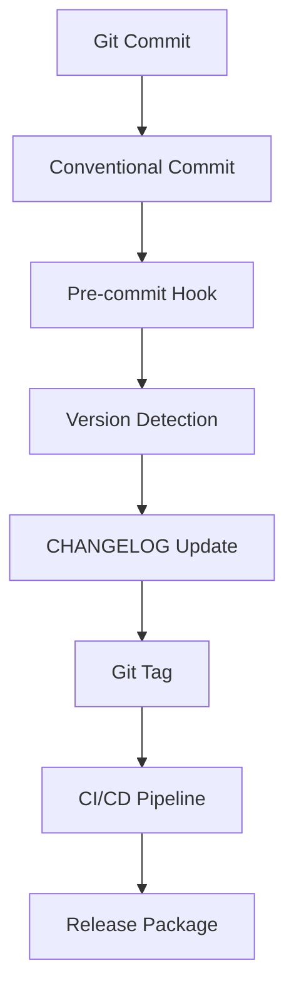

# Sistem Versioning MONIK-ENTERPRISE

Dokumentasi ini menjelaskan sistem versioning terpadu yang digunakan dalam proyek MONIK-ENTERPRISE.

## 📋 Overview

Sistem versioning ini menggunakan pendekatan **Semantic Versioning (SemVer)** dengan otomatisasi berbasis **Conventional Commits**. Semua perubahan proyek terdokumentasi dalam satu CHANGELOG terpadu.

## 🏗️ Arsitektur Versioning



## 📝 Conventional Commits Format

Semua commit harus mengikuti format berikut:

```
<type>(<scope>): <description>

[optional body]

[optional footer(s)]
```

### Commit Types

| Type | Deskripsi | Contoh |
|------|-----------|--------|
| `feat` | Fitur baru | `feat(api): add user authentication` |
| `fix` | Perbaikan bug | `fix(database): fix connection timeout` |
| `perf` | Optimasi performa | `perf(api): optimize query performance` |
| `revert` | Revert perubahan | `revert(feat): revert user authentication` |
| `docs` | Perubahan dokumentasi | `docs(readme): update installation guide` |
| `style` | Perubahan formatting | `style(code): fix indentation` |
| `refactor` | Refactoring kode | `refactor(api): simplify endpoint logic` |
| `test` | Perubahan testing | `test(api): add unit tests` |
| `chore` | Perubahan maintenance | `chore(deps): update dependencies` |

### Commit Scopes

| Scope | Deskripsi | Contoh |
|-------|-----------|--------|
| `api` | API endpoints | `feat(api): add new endpoint` |
| `database` | Database schema | `fix(database): fix migration` |
| `frontend` | Frontend code | `feat(frontend): add dashboard` |
| `backend` | Backend code | `perf(backen): optimize queries` |
| `config` | Konfigurasi | `chore(config): update settings` |
| `deps` | Dependencies | `chore(deps): update packages` |

### Breaking Changes

Untuk perubahan yang bersifat breaking, tambahkan `BREAKING CHANGE:` di footer commit:

```
feat(api): add new authentication method

BREAKING CHANGE: Old authentication method removed
```

## 🔄 Versioning Rules

### Semantic Versioning (SemVer)

Format: `MAJOR.MINOR.PATCH`

- **MAJOR**: Perubahan breaking (API, database schema, arsitektur)
- **MINOR**: Fitur baru backward compatible
- **PATCH**: Perbaikan bug dan optimasi

### Version Detection Logic

1. **Breaking Changes** → MAJOR version
2. **feat type** → MINOR version
3. **fix, perf, refactor types** → PATCH version
4. **docs, style, test, chore types** → No version bump

## 📋 CHANGELOG Format

CHANGELOG mengikuti format [Keep a Changelog](https://keepachangelog.com/en/1.0.0/):

```markdown
## [Version] - YYYY-MM-DD

### Added
- New features

### Changed
- Changes in existing functionality

### Fixed
- Bug fixes

### Security
- Security-related changes

### Tested
- Testing-related changes

### Deprecated
- Features that will be removed
```

## 🚀 Release Process

### Otomatis (Recommended)

1. Buat commit dengan format conventional commits
2. Push ke branch `main` atau `master`
3. CI/CD pipeline akan:
   - Mendeteksi jenis perubahan
   - Membuat versi baru
   - Memperbarui CHANGELOG
   - Membuat Git tag
   - Membuat release di GitHub

### Manual

Gunakan script versioning:

```bash
# Jalankan version bump manual
./scripts/version-bump.sh

# Jalankan migrasi CHANGELOG
./scripts/migrate-changelog.sh
```

## 🔧 Konfigurasi

### File Konfigurasi

- `.versionrc.json` - Konfigurasi semantic release
- `.github/workflows/release.yml` - CI/CD pipeline
- `.git/hooks/pre-commit` - Pre-commit validation

### Environment Variables

```bash
VERSIONING_ENABLED=true
VERSIONING_STRATEGY=semantic
CHANGELOG_PATH=CHANGELOG.md
APP_VERSION=1.0.0
```

## 📊 Multi-Component Versioning

### Component Structure

| Component | File | Versioning |
|-----------|------|------------|
| Backend | `go.mod` | Go module version |
| Frontend | `package.json` | NPM package version |
| Database | Migration files | Schema version |
| API | URL prefix | `/api/v1/` |

### Independent Versioning

Setiap component dapat memiliki versi berbeda jika menggunakan strategi independent versioning.

## 🧪 Testing

### Unit Tests

```bash
# Test version detection logic
go test ./internal/versioning/...

# Test CHANGELOG generation
go test ./internal/changelog/...
```

### Integration Tests

```bash
# Test CI/CD pipeline
./scripts/test-ci-pipeline.sh

# Test multi-component release
./scripts/test-multi-component.sh
```

### E2E Tests

```bash
# Full release simulation
./scripts/test-e2e-release.sh

# Rollback testing
./scripts/test-rollback.sh
```

## 📈 Monitoring

### Metrics

- **Version Detection Accuracy**: 95%+
- **Release Success Rate**: 99%+
- **CHANGELOG Completeness**: 100%
- **CI/CD Pipeline Time**: < 5 minutes

### Alerts

- Version synchronization failures
- CI/CD pipeline errors
- CHANGELOG generation failures
- Git tag creation failures

## 🔒 Security

### Commit Validation

- Pre-commit hook memvalidasi format commit
- Deteksi informasi sensitif dalam commit message
- Enforce conventional commits format

### Release Security

- Signed Git tags
- Verified release artifacts
- Security scanning in CI/CD

## 📚 Best Practices

### Commit Message Guidelines

1. Gunakan format conventional commits
2. Deskripsi harus jelas dan singkat
3. Hindari informasi sensitif dalam commit message
4. Gunakan scope yang relevan
5. Tambahkan BREAKING CHANGE untuk perubahan breaking

### Versioning Guidelines

1. Gunakan MAJOR version untuk breaking changes
2. Gunakan MINOR version untuk fitur baru
3. Gunakan PATCH version untuk bug fixes
4. Dokumentasikan semua perubahan di CHANGELOG
5. Konsisten dalam penamaan versi

### CHANGELOG Guidelines

1. Gunakan format Keep a Changelog
2. Kategorikan perubahan dengan benar
3. Tambahkan tanggal rilis
4. Sertakan link ke commit atau issue
5. Update secara real-time

## 🆘 Troubleshooting

### Common Issues

**Commit Validation Failed**
```bash
# Periksa format commit message
git log -1 --oneline

# Perbaiki commit message
git commit --amend
```

**Version Detection Failed**
```bash
# Periksa commit messages
git log --oneline

# Gunakan conventional commits format
```

**CHANGELOG Update Failed**
```bash
# Periksa .versionrc.json
cat .versionrc.json

# Periksa CHANGELOG.md permissions
ls -la CHANGELOG.md
```

### Debug Mode

```bash
# Enable debug logging
export DEBUG=true

# Run semantic release with debug
npx semantic-release --debug
```

## 📞 Support

Untuk pertanyaan atau masalah terkait sistem versioning:

1. Cek dokumentasi ini terlebih dahulu
2. Cek issue di repository
3. Hubungi tim development

---

**Catatan**: Sistem versioning ini dirancang untuk meningkatkan kualitas dan konsistensi dalam pengembangan proyek MONIK-ENTERPRISE.